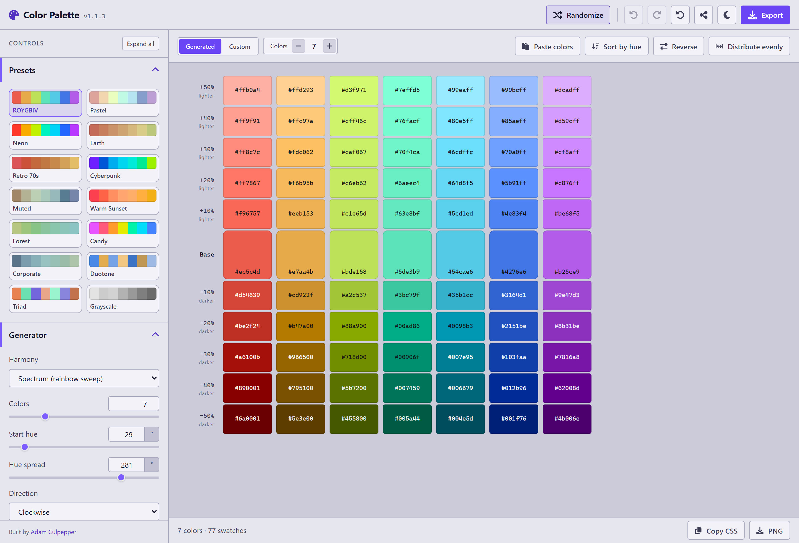

# Color Palette

Build a palette of any length, from a rainbow sweep to a color harmony, get the lighter and darker ladder for every color in it, then export the whole set as CSS, SCSS, LESS, a Tailwind color object, JSON design tokens, an SVG sheet, or a PNG/JPG/WebP image.

**[Live demo](https://colorpalette.adamculpepper.net/)**



## What it does

A normal rainbow is seven colors. This one runs from 2 to 24, spaced evenly across whatever arc of the color wheel you point it at. Every base color then gets a ladder of tints and shades in the percent step you choose, each row labeled lighter or darker. The default shows five 10% steps each way (77 swatches from seven colors); one slider runs it to the full nine, stopping 10% short of white and black.

You can skip the generator entirely and paste your own colors instead. Both paths land in the same place: a row of base colors, a grid under and over it, and one set of adjustment sliders that pulls everything toward looking like a family. Unify, hue, temperature, saturation, lightness, contrast. Push them until it reads right, then export.

Everything runs in the browser. Nothing is uploaded, and the app makes no network requests at runtime.

## Features

- **Generator.** 2 to 24 colors across a hue arc you set: start hue, spread, direction, plus easing if you want the colors bunched at one end of the sweep.
- **Harmony modes.** Spectrum spaces the colors evenly along an arc, and True rainbow puts them on the seven named spectral hues so yellow lands on yellow. Complementary, split complementary, triad, and tetrad drop the colors onto the classic wheel relationships instead, analogous keeps them inside a 90 degree fan, and monochrome runs one hue through a lightness ramp. The hue arc controls disappear on the modes that do not read them.
- **Natural lightness mode.** Each hue sits at the lightness where it is actually most colorful on a screen, with one knob to flatten that curve toward a single target. It is what keeps yellow from landing as mustard.
- **Tint and shade grid.** Steps from 2% to 25%, up to nine of them each way (nine 10% steps runs the full ladder). Every step row is labeled with its percent and direction (lighter or darker). Zero steps collapses to the bare rainbow row.
- **Custom palettes.** Paste hex or `rgb()` values in almost any messy format, edit a swatch by hex field, native color picker, or lightness/chroma/hue sliders, drag the base row to reorder. Sort by hue, reverse, and distribute evenly are one click each.
- **Harmonize filters.** Unify converges hue and saturation together; separate dials handle hue shift, temperature, saturation, lightness, and contrast. Grays are held in place by default so a neutral in a pasted palette never drifts beige.
- **40 presets.** Five pages of eight, from Midnight and Noir through Sea Glass and Blush to Acid and Highlighter, plus one for every harmony mode. A preset is a starting point merged over your current settings, not a mode you get stuck in, so your color count and step ladder survive the click.
- **8 color units.** hex, `rgb()`, `rgba()`, `hsl()`, `hsla()`, `hwb()`, `oklch()`, `oklab()`. One select drives the code exports, the swatch labels, and the editor readouts at the same time.
- **Exports with a live preview.** Every code format shows its exact file content in the export dialog, rewritten as you change the palette, the unit, or the naming. Image formats show a rendered thumbnail at the scale, layout, and background you picked. Copy and download act on precisely what is on screen.
- **Undo, redo, share links.** One slider drag is one undo entry, not thirty. The full configuration, custom colors included, is packed into the URL hash.
- **Dark and light themes**, seeded from your OS setting and remembered after that.

## Getting started

```bash
npm install
npm run dev        # start the Vite dev server
npm run build      # production build into dist/
npm run preview    # serve the production build
```

Open the printed local URL (usually http://localhost:5173).

## Keyboard shortcuts

| Key | Action |
| --- | --- |
| `R` | Randomize |
| `Ctrl/Cmd + Z` | Undo |
| `Ctrl + Y` / `Ctrl/Cmd + Shift + Z` | Redo |
| `E` | Open the export dialog |
| `C` | Copy the palette as CSS |
| Arrow keys | Move between base swatches |
| `Enter` / `Space` | Open the editor for the focused swatch |
| `Delete` / `Backspace` | Remove the focused color |
| `Esc` | Close the open dialog or popover |

Letter shortcuts stay quiet while you are typing in a field or while a dialog has focus, so `C` in a hex input types a `c`.

## How the color engine works

Most color tools do their math in HSL, which is quick to compute and misleading to look at. Ask HSL for yellow and blue at the same lightness and you get a yellow that blinds you next to a blue you can barely see. The numbers match; your eye disagrees.

This app works in OKLCH instead. Same three ideas as HSL (lightness, colorfulness, hue), but built so that equal numbers look equal. Colorfulness is called *chroma* there, and it is the word the controls use.

### Why a flat-lightness rainbow turns yellow into mud

Pick one lightness, sweep the hue all the way around, and your yellow comes out brown. That is not a math error. It is what screens can do: sRGB has no dark, vivid yellow to give you. At lightness 68%, the most colorful yellow available is `#c68c27`, which is mustard sitting in a row of otherwise bright colors.

Natural lightness mode fixes this by giving every hue the lightness where that hue is at its most colorful on a screen. Red peaks around 63%, yellow around 97%, blue around 49%. The Lightness slider then flattens that curve toward one target, so you can sit anywhere between "true to how hues actually behave" and "everything at the same brightness". Flat mode is still there when you need identical lightness across a chart legend and can live with the mud.

The default seven-color output: `#ec5c4d` `#e7aa4b` `#bde158` `#5de3b9` `#54cae6` `#4276e6` `#b25ce9`.

### Why an even rainbow has no yellow in it

The seven named colors are not evenly spaced around the wheel. Red sits 26 degrees from orange, but green sits 105 degrees from blue. Space seven colors evenly across the same span and they land on 29, 76, 123 and so on, stepping straight over yellow at 110 and dropping amber and lime either side of it. That is why an even sweep has no canary yellow in it, and why the app names those two colors amber and lime rather than pretending otherwise.

True rainbow walks the named hues instead of even degrees, so the yellow slot is really yellow. Counts other than seven interpolate along that same path, so a 12-color palette still passes through yellow on its way.

### What the harmony modes do

Spectrum spaces the colors evenly along an arc of the wheel, and that is the rainbow the app opens with. The other modes ignore the arc and put every color on a fixed set of hues measured from the start hue: the opposite hue for complementary, the two either side of it for split complementary, evenly spaced thirds and quarters for triad and tetrad, and one hue on its own for monochrome. Analogous sits in between, a normal sweep with its spread capped at 90 degrees so the colors stay neighbors. When a mode has fewer hues than the palette has colors, the extra colors go round the hues again. Each extra pass moves its lightness further off the base, up then down, and pulls its chroma back a little, so a second red comes out as a lighter or darker red instead of the same red twice.

### What unify does

Unify is one slider driving two moves at once. As you raise it, every hue slides toward the average hue of the palette and every chroma slides toward the average chroma. At 100 the palette has collapsed onto a single hue at a single intensity, which is rarely what you want. Somewhere in the middle is the point of it: enough pull that six unrelated pasted colors read as a set, not so much that they stop being distinguishable.

Grays get skipped. A gray has no meaningful hue (its hue reading is arithmetic noise from being almost perfectly neutral), so dragging it toward the palette average turns `#c9c9c9` into beige. Preserve neutrals is on by default and holds anything under 2% chroma exactly where it is.

### What "10% lighter" means here

It does not mean "add 10 to the lightness number". Each step travels 10% of the distance still remaining between the color and white, and the darker side mirrors that toward black. A color that is already pale can keep getting lighter without clipping, and a near-black one shades down to something that is still a color rather than flat `#000`. Ladders stop at 95% of the way, so no rung is ever pure white or pure black.

Chroma is held at the base color's value through the whole ladder and pulled back only when a step would land outside what a screen can show. The middle of the ladder stays vivid and the ends soften on their own. If you want the classic washed-out tints, the Pastel tints slider adds a deliberate taper on top.

### Where the numbers go

`buildPalette(settings)` is the single seam in the app. Generate or read the custom colors, run the harmonize filters, build each ladder, name everything, and hand back one object:

```js
{
  source: 'generated',
  colors: [{ index, hex, name, token, base: { L, C, H }, steps: [...] }],
  meta: { count, stepPercent, stepCount },
}
```

Every exporter reads that object and nothing else, so CSS, SVG, and PNG can never disagree about what the palette is.

## Project structure

```
src/
  lib/color/    oklch (conversions, gamut mapping), parse, format, contrast
  lib/          rainbow, scale, harmonize, naming, palette (the facade above),
                paletteOps, stateCodec, prng, randomize, storage
  lib/export/   code (CSS/SCSS/LESS), tailwind, tokens, svg, raster, download
  data/         params (the control registry), presets, version
  context/      AppContext (settings, history, theme)
  hooks/        usePalette, useKeyboard, useCopyFlag, useMediaQuery
  components/   Header, Sidebar, ControlSection, controls/, Stage, PaletteGrid,
                Swatch, SwatchEditor, PaletteImport, ExportModal, Toast, Tooltip
  styles/       variables, themes, global CSS
scripts/        verify-engine.mjs, verify-exports.mjs
```

One registry in `src/data/params.js` describes every control, and that array feeds the sidebar, the defaults, randomize, and the share URL. Adding a knob is one entry plus whatever reads it in `lib/`.

## Verify scripts

```bash
npm run verify:engine     # 116 checks
npm run verify:exports    # 83 checks
```

`verify:engine` pins the color math: the default rainbow's exact hexes, natural lightness tracking the gamut cusp, the `#e84739` ladder from +50% to -50%, each harmonize filter doing what its label claims, the eight units round-tripping, token naming and dedupe, and a source scan proving nothing under `src/lib/` reads the clock or calls `Math.random`. The edge cases get their own section: a one-color palette, near-white and near-black ladders, a full-circle sweep, junk tokens in a pasted list. The harmony section pins where each mode puts its hues, how a palette of seven divides between two, three, and four of them, and the spectrum row byte for byte, so adding a mode cannot move the default rainbow.

`verify:exports` runs the format registry: parseable CSS/SCSS/LESS output, the Tailwind object shape, W3C token structure, SVG geometry, raster layout, every color unit through the CSS builder, duplicate-name handling, and filenames.

Both print a pass line per check and exit non-zero on the first failure, so they work as a pre-push gate.

## Deploy

`.github/workflows/deploy.yml` builds on every push to `master` and publishes `dist/` to GitHub Pages. In the repo settings, Pages needs its source set to **GitHub Actions** for the first run to land.

Two things the build depends on:

- `vite.config.js` sets `base: './'`, so the bundle works from the `/color-palette/` subpath Pages serves it from.
- The workflow deletes `package-lock.json` before installing. A lockfile generated on Windows leaves out the Linux rollup optional dependencies (npm/cli#4828), and the Linux runner needs to resolve those fresh.

## Tech stack

Vite 5 and React 18, no TypeScript, plain co-located CSS with custom properties. FontAwesome for icons, installed from npm rather than a CDN.

The color math carries no dependencies. Conversions between sRGB, OKLab, and OKLCH are written out, and gamut mapping is a binary search on chroma so a clamped color keeps its hue. Cusp lightness comes from a 360-entry table built at module load, since it gets asked for once per color per render.
